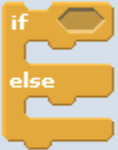

# Control
Blocks in this category organize the flow of scripts. They dictate when scripts start and provide functions to loop over blocks or only execute blocks in certain cases. 

## If/Else

Lorem ipsum dolor sit amet, consectetur adipiscing elit. Mauris elementum orci sit amet rutrum tincidunt.

| Parameter | Visual | Definition |
|:- |:- |:- |
| Condition |  | Lorem ipsum dolor sit amet, consectetur adipiscing elit. Mauris elementum orci sit amet rutrum tincidunt. |
| [Command slot]() |  | The open space a C or E shaped block that holds command block or report block |

| Example | Definition |
|:- |:- |
|  | Lorem ipsum dolor sit amet, consectetur adipiscing elit. Mauris elementum orci sit amet rutrum tincidunt. |

**Related:** [Turn counter clockwise]() | **Lessons:** [a really long lesson name](), [another really long lesson name]()
