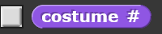
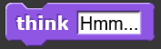
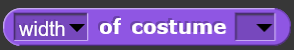
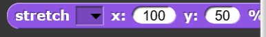
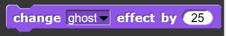
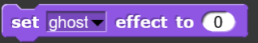
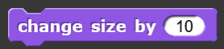
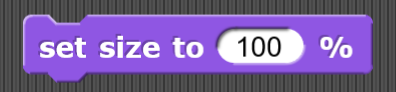
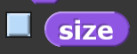
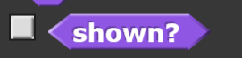

# Looks
Blocks in this category deal with the appearance of sprites and the stage. Examples include showing or hiding a sprite, making sprites talk, and switching costumes.

## Switch to costume

| Example | Definition |
|:- |:- |
|  |  |

## Next costume

| Example | Definition |
|:- |:- |
|  |  |

## Costume number

| Example | Definition |
|:- |:- |
|  |  |

## Say something timed

| Example | Definition |
|:- |:- |
|  |  |

## Say something

| Example | Definition |
|:- |:- |
|  |  |

## Think something timed

| Example | Definition |
|:- |:- |
|  |  |

## Think something

| Example | Definition |
|:- |:- |
|  |  |

## Properties of costume

| Example | Definition |
|:- |:- |
|  |  |

## Stretch sprite

| Example | Definition |
|:- |:- |
|  |  |

## Change effect

| Example | Definition |
|:- |:- |
|  |  |

## Set effect

| Example | Definition |
|:- |:- |
|  |  |

## Clear graphic effects

| Example | Definition |
|:- |:- |
|  |  |

## Effect

| Example | Definition |
|:- |:- |
|  |  |

## Change size

| Example | Definition |
|:- |:- |
|  |  |

## Set size

| Example | Definition |
|:- |:- |
|  |  |

## Size

| Example | Definition |
|:- |:- |
|  |  |

## Show

| Example | Definition |
|:- |:- |
|  |  |

## Hide

| Example | Definition |
|:- |:- |
|  |  |

## Shown?

| Example | Definition |
|:- |:- |
|  |  |

## Go to a specific layer

| Example | Definition |
|:- |:- |
|  |  |

## Go back a specific number of layers

| Example | Definition |
|:- |:- |
|  |  |

