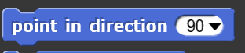
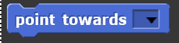
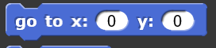
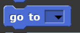
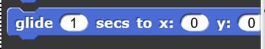
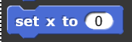

#Motion
Blocks in this category deal with the movement of sprites. They can be used to change the x and y position of the sprite as well as what direction the sprite is facing. Note: the Stage does not have any Motion blocks since it is a still object.

## Move

| Example | Definition |
|:- |:- |
|  | |

## Turn clockwise

| Example | Definition |
|:- |:- |
|  | |

## Turn counter clockwise

| Example | Definition |
|:- |:- |
|  | |

## Point in direction

| Example | Definition |
|:- |:- |
|  | |

## Point towards

| Example | Definition |
|:- |:- |
|  | |

## Go to a coordinate

| Example | Definition |
|:- |:- |
|  | |

## Go to

| Example | Definition |
|:- |:- |
|  | |

## Timed gliding to a coordinate

| Example | Definition |
|:- |:- |
|  | |

## Change x by

| Example | Definition |
|:- |:- |
|  | |

## Set x to

| Example | Definition |
|:- |:- |
|  | |

## Change y by

| Example | Definition |
|:- |:- |
|  | |

## Change y to

| Example | Definition |
|:- |:- |
|  | |

## If on edge, bounce

| Example | Definition |
|:- |:- |
|  | |

## X position

| Example | Definition |
|:- |:- |
|  | |

## Y position

| Example | Definition |
|:- |:- |
|  | |

## Direction

| Example | Definition |
|:- |:- |
|  | |

