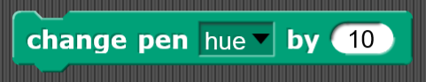
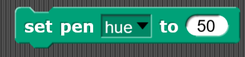
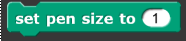
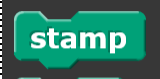
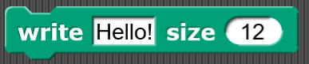

# Pen
The pen category provides blocks...

## Clear

Lorem ipsum dolor sit amet, consectetur adipiscing elit. Mauris elementum orci sit amet rutrum tincidunt.

| Parameter | Visual | Definition |
|:- |:- |:- |
| Condition |  | Lorem ipsum dolor sit amet, consectetur adipiscing elit. Mauris elementum orci sit amet rutrum tincidunt. |
| [Command slot]() |  | The open space a C or E shaped block that holds command block or report block |

| Example | Definition |
|:- |:- |
|  | Lorem ipsum dolor sit amet, consectetur adipiscing elit. Mauris elementum orci sit amet rutrum tincidunt. |
**Related:** [Turn counter clockwise]() | **Lessons:** [a really long lesson name](), [another really long lesson name]()

## Pen down

Lorem ipsum dolor sit amet, consectetur adipiscing elit. Mauris elementum orci sit amet rutrum tincidunt.

| Parameter | Visual | Definition |
|:- |:- |:- |
| Condition |  | Lorem ipsum dolor sit amet, consectetur adipiscing elit. Mauris elementum orci sit amet rutrum tincidunt. |
| [Command slot]() |  | The open space a C or E shaped block that holds command block or report block |

| Example | Definition |
|:- |:- |
|  | Lorem ipsum dolor sit amet, consectetur adipiscing elit. Mauris elementum orci sit amet rutrum tincidunt. |
**Related:** [Turn counter clockwise]() | **Lessons:** [a really long lesson name](), [another really long lesson name]()

## Pen up

Lorem ipsum dolor sit amet, consectetur adipiscing elit. Mauris elementum orci sit amet rutrum tincidunt.

| Parameter | Visual | Definition |
|:- |:- |:- |
| Condition |  | Lorem ipsum dolor sit amet, consectetur adipiscing elit. Mauris elementum orci sit amet rutrum tincidunt. |
| [Command slot]() |  | The open space a C or E shaped block that holds command block or report block |

| Example | Definition |
|:- |:- |
|  | Lorem ipsum dolor sit amet, consectetur adipiscing elit. Mauris elementum orci sit amet rutrum tincidunt. |
**Related:** [Turn counter clockwise]() | **Lessons:** [a really long lesson name](), [another really long lesson name]()

## Pen down?

Lorem ipsum dolor sit amet, consectetur adipiscing elit. Mauris elementum orci sit amet rutrum tincidunt.

| Parameter | Visual | Definition |
|:- |:- |:- |
| Condition |  | Lorem ipsum dolor sit amet, consectetur adipiscing elit. Mauris elementum orci sit amet rutrum tincidunt. |
| [Command slot]() |  | The open space a C or E shaped block that holds command block or report block |

| Example | Definition |
|:- |:- |
|  | Lorem ipsum dolor sit amet, consectetur adipiscing elit. Mauris elementum orci sit amet rutrum tincidunt. |
**Related:** [Turn counter clockwise]() | **Lessons:** [a really long lesson name](), [another really long lesson name]()

## Set pen color

Lorem ipsum dolor sit amet, consectetur adipiscing elit. Mauris elementum orci sit amet rutrum tincidunt.

| Parameter | Visual | Definition |
|:- |:- |:- |
| Condition |  | Lorem ipsum dolor sit amet, consectetur adipiscing elit. Mauris elementum orci sit amet rutrum tincidunt. |
| [Command slot]() |  | The open space a C or E shaped block that holds command block or report block |

| Example | Definition |
|:- |:- |
|  | Lorem ipsum dolor sit amet, consectetur adipiscing elit. Mauris elementum orci sit amet rutrum tincidunt. |
**Related:** [Turn counter clockwise]() | **Lessons:** [a really long lesson name](), [another really long lesson name]()

## Change pen color setting

Lorem ipsum dolor sit amet, consectetur adipiscing elit. Mauris elementum orci sit amet rutrum tincidunt.

| Parameter | Visual | Definition |
|:- |:- |:- |
| Condition |  | Lorem ipsum dolor sit amet, consectetur adipiscing elit. Mauris elementum orci sit amet rutrum tincidunt. |
| [Command slot]() |  | The open space a C or E shaped block that holds command block or report block |

| Example | Definition |
|:- |:- |
|  | Lorem ipsum dolor sit amet, consectetur adipiscing elit. Mauris elementum orci sit amet rutrum tincidunt. |
**Related:** [Turn counter clockwise]() | **Lessons:** [a really long lesson name](), [another really long lesson name]()

## Set pen color setting

Lorem ipsum dolor sit amet, consectetur adipiscing elit. Mauris elementum orci sit amet rutrum tincidunt.

| Parameter | Visual | Definition |
|:- |:- |:- |
| Condition |  | Lorem ipsum dolor sit amet, consectetur adipiscing elit. Mauris elementum orci sit amet rutrum tincidunt. |
| [Command slot]() |  | The open space a C or E shaped block that holds command block or report block |

| Example | Definition |
|:- |:- |
|  | Lorem ipsum dolor sit amet, consectetur adipiscing elit. Mauris elementum orci sit amet rutrum tincidunt. |
**Related:** [Turn counter clockwise]() | **Lessons:** [a really long lesson name](), [another really long lesson name]()

## Pen color properties

Lorem ipsum dolor sit amet, consectetur adipiscing elit. Mauris elementum orci sit amet rutrum tincidunt.

| Parameter | Visual | Definition |
|:- |:- |:- |
| Condition |  | Lorem ipsum dolor sit amet, consectetur adipiscing elit. Mauris elementum orci sit amet rutrum tincidunt. |
| [Command slot]() |  | The open space a C or E shaped block that holds command block or report block |

| Example | Definition |
|:- |:- |
|  | Lorem ipsum dolor sit amet, consectetur adipiscing elit. Mauris elementum orci sit amet rutrum tincidunt. |
**Related:** [Turn counter clockwise]() | **Lessons:** [a really long lesson name](), [another really long lesson name]()

## Change pen size

Lorem ipsum dolor sit amet, consectetur adipiscing elit. Mauris elementum orci sit amet rutrum tincidunt.

| Parameter | Visual | Definition |
|:- |:- |:- |
| Condition |  | Lorem ipsum dolor sit amet, consectetur adipiscing elit. Mauris elementum orci sit amet rutrum tincidunt. |
| [Command slot]() |  | The open space a C or E shaped block that holds command block or report block |

| Example | Definition |
|:- |:- |
|  | Lorem ipsum dolor sit amet, consectetur adipiscing elit. Mauris elementum orci sit amet rutrum tincidunt. |
**Related:** [Turn counter clockwise]() | **Lessons:** [a really long lesson name](), [another really long lesson name]()

## Set pen size 

Lorem ipsum dolor sit amet, consectetur adipiscing elit. Mauris elementum orci sit amet rutrum tincidunt.

| Parameter | Visual | Definition |
|:- |:- |:- |
| Condition |  | Lorem ipsum dolor sit amet, consectetur adipiscing elit. Mauris elementum orci sit amet rutrum tincidunt. |
| [Command slot]() |  | The open space a C or E shaped block that holds command block or report block |

| Example | Definition |
|:- |:- |
|  | Lorem ipsum dolor sit amet, consectetur adipiscing elit. Mauris elementum orci sit amet rutrum tincidunt. |
**Related:** [Turn counter clockwise]() | **Lessons:** [a really long lesson name](), [another really long lesson name]()

## Stamp

Lorem ipsum dolor sit amet, consectetur adipiscing elit. Mauris elementum orci sit amet rutrum tincidunt.

| Parameter | Visual | Definition |
|:- |:- |:- |
| Condition |  | Lorem ipsum dolor sit amet, consectetur adipiscing elit. Mauris elementum orci sit amet rutrum tincidunt. |
| [Command slot]() |  | The open space a C or E shaped block that holds command block or report block |

| Example | Definition |
|:- |:- |
|  | Lorem ipsum dolor sit amet, consectetur adipiscing elit. Mauris elementum orci sit amet rutrum tincidunt. |
**Related:** [Turn counter clockwise]() | **Lessons:** [a really long lesson name](), [another really long lesson name]()

## Fill

Lorem ipsum dolor sit amet, consectetur adipiscing elit. Mauris elementum orci sit amet rutrum tincidunt.

| Parameter | Visual | Definition |
|:- |:- |:- |
| Condition |  | Lorem ipsum dolor sit amet, consectetur adipiscing elit. Mauris elementum orci sit amet rutrum tincidunt. |
| [Command slot]() |  | The open space a C or E shaped block that holds command block or report block |

| Example | Definition |
|:- |:- |
|  | Lorem ipsum dolor sit amet, consectetur adipiscing elit. Mauris elementum orci sit amet rutrum tincidunt. |
**Related:** [Turn counter clockwise]() | **Lessons:** [a really long lesson name](), [another really long lesson name]()

## Write something at a certain size

Lorem ipsum dolor sit amet, consectetur adipiscing elit. Mauris elementum orci sit amet rutrum tincidunt.

| Parameter | Visual | Definition |
|:- |:- |:- |
| Condition |  | Lorem ipsum dolor sit amet, consectetur adipiscing elit. Mauris elementum orci sit amet rutrum tincidunt. |
| [Command slot]() |  | The open space a C or E shaped block that holds command block or report block |

| Example | Definition |
|:- |:- |
|  | Lorem ipsum dolor sit amet, consectetur adipiscing elit. Mauris elementum orci sit amet rutrum tincidunt. |
**Related:** [Turn counter clockwise]() | **Lessons:** [a really long lesson name](), [another really long lesson name]()

## Pen trails

Lorem ipsum dolor sit amet, consectetur adipiscing elit. Mauris elementum orci sit amet rutrum tincidunt.

| Parameter | Visual | Definition |
|:- |:- |:- |
| Condition |  | Lorem ipsum dolor sit amet, consectetur adipiscing elit. Mauris elementum orci sit amet rutrum tincidunt. |
| [Command slot]() |  | The open space a C or E shaped block that holds command block or report block |

| Example | Definition |
|:- |:- |
|  | Lorem ipsum dolor sit amet, consectetur adipiscing elit. Mauris elementum orci sit amet rutrum tincidunt. |
**Related:** [Turn counter clockwise]() | **Lessons:** [a really long lesson name](), [another really long lesson name]()
