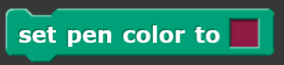
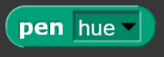
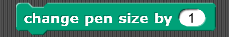

# Pen
Blocks in this category deal with a sprite's pen, which is located at the center of a sprite. The pen allows a line to be drawn following the sprite's motion. Some blocks include lifting the pen up and down, setting the pen color and changing the size of the pen.

## Clear

| Example | Definition |
|:- |:- |
|  |  |

## Pen down

| Example | Definition |
|:- |:- |
|  |  |

## Pen up

| Example | Definition |
|:- |:- |
|  |  |

## Pen down?

| Example | Definition |
|:- |:- |
|  |  |

## Set pen color

| Example | Definition |
|:- |:- |
|  |  |

## Change pen color setting

| Example | Definition |
|:- |:- |
|  |  |

## Set pen color setting

| Example | Definition |
|:- |:- |
|  |  |

## Pen color properties

| Example | Definition |
|:- |:- |
|  |  |

## Change pen size

| Example | Definition |
|:- |:- |
|  |  |

## Set pen size 

| Example | Definition |
|:- |:- |
|  |  |

## Stamp

| Example | Definition |
|:- |:- |
|  |  |

## Fill

| Example | Definition |
|:- |:- |
|  |  |

## Write something at a certain size

| Example | Definition |
|:- |:- |
|  |  |

## Pen trails

| Example | Definition |
|:- |:- |
|  |  |

