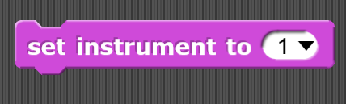
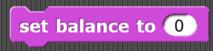

# Sound
The sound category provides blocks...

## Play sound

Lorem ipsum dolor sit amet, consectetur adipiscing elit. Mauris elementum orci sit amet rutrum tincidunt.

| Parameter | Visual | Definition |
|:- |:- |:- |
| Condition |  | Lorem ipsum dolor sit amet, consectetur adipiscing elit. Mauris elementum orci sit amet rutrum tincidunt. |
| [Command slot]() |  | The open space a C or E shaped block that holds command block or report block |

| Example | Definition |
|:- |:- |
|  | Lorem ipsum dolor sit amet, consectetur adipiscing elit. Mauris elementum orci sit amet rutrum tincidunt. |
**Related:** [Turn counter clockwise]() | **Lessons:** [a really long lesson name](), [another really long lesson name]()

## Play sound until done

Lorem ipsum dolor sit amet, consectetur adipiscing elit. Mauris elementum orci sit amet rutrum tincidunt.

| Parameter | Visual | Definition |
|:- |:- |:- |
| Condition |  | Lorem ipsum dolor sit amet, consectetur adipiscing elit. Mauris elementum orci sit amet rutrum tincidunt. |
| [Command slot]() |  | The open space a C or E shaped block that holds command block or report block |

| Example | Definition |
|:- |:- |
|  | Lorem ipsum dolor sit amet, consectetur adipiscing elit. Mauris elementum orci sit amet rutrum tincidunt. |
**Related:** [Turn counter clockwise]() | **Lessons:** [a really long lesson name](), [another really long lesson name]()

## Stop all sounds

Lorem ipsum dolor sit amet, consectetur adipiscing elit. Mauris elementum orci sit amet rutrum tincidunt.

| Parameter | Visual | Definition |
|:- |:- |:- |
| Condition |  | Lorem ipsum dolor sit amet, consectetur adipiscing elit. Mauris elementum orci sit amet rutrum tincidunt. |
| [Command slot]() |  | The open space a C or E shaped block that holds command block or report block |

| Example | Definition |
|:- |:- |
|  | Lorem ipsum dolor sit amet, consectetur adipiscing elit. Mauris elementum orci sit amet rutrum tincidunt. |
**Related:** [Turn counter clockwise]() | **Lessons:** [a really long lesson name](), [another really long lesson name]()

## Play sound at frequency

Lorem ipsum dolor sit amet, consectetur adipiscing elit. Mauris elementum orci sit amet rutrum tincidunt.

| Parameter | Visual | Definition |
|:- |:- |:- |
| Condition |  | Lorem ipsum dolor sit amet, consectetur adipiscing elit. Mauris elementum orci sit amet rutrum tincidunt. |
| [Command slot]() |  | The open space a C or E shaped block that holds command block or report block |

| Example | Definition |
|:- |:- |
|  | Lorem ipsum dolor sit amet, consectetur adipiscing elit. Mauris elementum orci sit amet rutrum tincidunt. |
**Related:** [Turn counter clockwise]() | **Lessons:** [a really long lesson name](), [another really long lesson name]()

## Properties of sound

Lorem ipsum dolor sit amet, consectetur adipiscing elit. Mauris elementum orci sit amet rutrum tincidunt.

| Parameter | Visual | Definition |
|:- |:- |:- |
| Condition |  | Lorem ipsum dolor sit amet, consectetur adipiscing elit. Mauris elementum orci sit amet rutrum tincidunt. |
| [Command slot]() |  | The open space a C or E shaped block that holds command block or report block |

| Example | Definition |
|:- |:- |
|  | Lorem ipsum dolor sit amet, consectetur adipiscing elit. Mauris elementum orci sit amet rutrum tincidunt. |
**Related:** [Turn counter clockwise]() | **Lessons:** [a really long lesson name](), [another really long lesson name]()

## Rest for set amount of beats

Lorem ipsum dolor sit amet, consectetur adipiscing elit. Mauris elementum orci sit amet rutrum tincidunt.

| Parameter | Visual | Definition |
|:- |:- |:- |
| Condition |  | Lorem ipsum dolor sit amet, consectetur adipiscing elit. Mauris elementum orci sit amet rutrum tincidunt. |
| [Command slot]() |  | The open space a C or E shaped block that holds command block or report block |

| Example | Definition |
|:- |:- |
|  | Lorem ipsum dolor sit amet, consectetur adipiscing elit. Mauris elementum orci sit amet rutrum tincidunt. |
**Related:** [Turn counter clockwise]() | **Lessons:** [a really long lesson name](), [another really long lesson name]()

## Play a note for set amount of beats

Lorem ipsum dolor sit amet, consectetur adipiscing elit. Mauris elementum orci sit amet rutrum tincidunt.

| Parameter | Visual | Definition |
|:- |:- |:- |
| Condition |  | Lorem ipsum dolor sit amet, consectetur adipiscing elit. Mauris elementum orci sit amet rutrum tincidunt. |
| [Command slot]() |  | The open space a C or E shaped block that holds command block or report block |

| Example | Definition |
|:- |:- |
|  | Lorem ipsum dolor sit amet, consectetur adipiscing elit. Mauris elementum orci sit amet rutrum tincidunt. |
**Related:** [Turn counter clockwise]() | **Lessons:** [a really long lesson name](), [another really long lesson name]()

## Set instrument

Lorem ipsum dolor sit amet, consectetur adipiscing elit. Mauris elementum orci sit amet rutrum tincidunt.

| Parameter | Visual | Definition |
|:- |:- |:- |
| Condition |  | Lorem ipsum dolor sit amet, consectetur adipiscing elit. Mauris elementum orci sit amet rutrum tincidunt. |
| [Command slot]() |  | The open space a C or E shaped block that holds command block or report block |

| Example | Definition |
|:- |:- |
|  | Lorem ipsum dolor sit amet, consectetur adipiscing elit. Mauris elementum orci sit amet rutrum tincidunt. |
**Related:** [Turn counter clockwise]() | **Lessons:** [a really long lesson name](), [another really long lesson name]()

## Change tempo by a set integer

Lorem ipsum dolor sit amet, consectetur adipiscing elit. Mauris elementum orci sit amet rutrum tincidunt.

| Parameter | Visual | Definition |
|:- |:- |:- |
| Condition |  | Lorem ipsum dolor sit amet, consectetur adipiscing elit. Mauris elementum orci sit amet rutrum tincidunt. |
| [Command slot]() |  | The open space a C or E shaped block that holds command block or report block |

| Example | Definition |
|:- |:- |
|  | Lorem ipsum dolor sit amet, consectetur adipiscing elit. Mauris elementum orci sit amet rutrum tincidunt. |
**Related:** [Turn counter clockwise]() | **Lessons:** [a really long lesson name](), [another really long lesson name]()

## Set tempo to a specific beats per minute

Lorem ipsum dolor sit amet, consectetur adipiscing elit. Mauris elementum orci sit amet rutrum tincidunt.

| Parameter | Visual | Definition |
|:- |:- |:- |
| Condition |  | Lorem ipsum dolor sit amet, consectetur adipiscing elit. Mauris elementum orci sit amet rutrum tincidunt. |
| [Command slot]() |  | The open space a C or E shaped block that holds command block or report block |

| Example | Definition |
|:- |:- |
|  | Lorem ipsum dolor sit amet, consectetur adipiscing elit. Mauris elementum orci sit amet rutrum tincidunt. |
**Related:** [Turn counter clockwise]() | **Lessons:** [a really long lesson name](), [another really long lesson name]()

## Tempo

Lorem ipsum dolor sit amet, consectetur adipiscing elit. Mauris elementum orci sit amet rutrum tincidunt.

| Parameter | Visual | Definition |
|:- |:- |:- |
| Condition |  | Lorem ipsum dolor sit amet, consectetur adipiscing elit. Mauris elementum orci sit amet rutrum tincidunt. |
| [Command slot]() |  | The open space a C or E shaped block that holds command block or report block |

| Example | Definition |
|:- |:- |
|  | Lorem ipsum dolor sit amet, consectetur adipiscing elit. Mauris elementum orci sit amet rutrum tincidunt. |
**Related:** [Turn counter clockwise]() | **Lessons:** [a really long lesson name](), [another really long lesson name]()

## Change volume by a set integer

Lorem ipsum dolor sit amet, consectetur adipiscing elit. Mauris elementum orci sit amet rutrum tincidunt.

| Parameter | Visual | Definition |
|:- |:- |:- |
| Condition |  | Lorem ipsum dolor sit amet, consectetur adipiscing elit. Mauris elementum orci sit amet rutrum tincidunt. |
| [Command slot]() |  | The open space a C or E shaped block that holds command block or report block |

| Example | Definition |
|:- |:- |
|  | Lorem ipsum dolor sit amet, consectetur adipiscing elit. Mauris elementum orci sit amet rutrum tincidunt. |
**Related:** [Turn counter clockwise]() | **Lessons:** [a really long lesson name](), [another really long lesson name]()

## Set volume to a certain percentage

Lorem ipsum dolor sit amet, consectetur adipiscing elit. Mauris elementum orci sit amet rutrum tincidunt.

| Parameter | Visual | Definition |
|:- |:- |:- |
| Condition |  | Lorem ipsum dolor sit amet, consectetur adipiscing elit. Mauris elementum orci sit amet rutrum tincidunt. |
| [Command slot]() |  | The open space a C or E shaped block that holds command block or report block |

| Example | Definition |
|:- |:- |
|  | Lorem ipsum dolor sit amet, consectetur adipiscing elit. Mauris elementum orci sit amet rutrum tincidunt. |
**Related:** [Turn counter clockwise]() | **Lessons:** [a really long lesson name](), [another really long lesson name]()

## Volume

Lorem ipsum dolor sit amet, consectetur adipiscing elit. Mauris elementum orci sit amet rutrum tincidunt.

| Parameter | Visual | Definition |
|:- |:- |:- |
| Condition |  | Lorem ipsum dolor sit amet, consectetur adipiscing elit. Mauris elementum orci sit amet rutrum tincidunt. |
| [Command slot]() |  | The open space a C or E shaped block that holds command block or report block |

| Example | Definition |
|:- |:- |
|  | Lorem ipsum dolor sit amet, consectetur adipiscing elit. Mauris elementum orci sit amet rutrum tincidunt. |
**Related:** [Turn counter clockwise]() | **Lessons:** [a really long lesson name](), [another really long lesson name]()

## Change balance by a set integer

Lorem ipsum dolor sit amet, consectetur adipiscing elit. Mauris elementum orci sit amet rutrum tincidunt.

| Parameter | Visual | Definition |
|:- |:- |:- |
| Condition |  | Lorem ipsum dolor sit amet, consectetur adipiscing elit. Mauris elementum orci sit amet rutrum tincidunt. |
| [Command slot]() |  | The open space a C or E shaped block that holds command block or report block |

| Example | Definition |
|:- |:- |
|  | Lorem ipsum dolor sit amet, consectetur adipiscing elit. Mauris elementum orci sit amet rutrum tincidunt. |
**Related:** [Turn counter clockwise]() | **Lessons:** [a really long lesson name](), [another really long lesson name]()

## Set balance to a set integer

Lorem ipsum dolor sit amet, consectetur adipiscing elit. Mauris elementum orci sit amet rutrum tincidunt.

| Parameter | Visual | Definition |
|:- |:- |:- |
| Condition |  | Lorem ipsum dolor sit amet, consectetur adipiscing elit. Mauris elementum orci sit amet rutrum tincidunt. |
| [Command slot]() |  | The open space a C or E shaped block that holds command block or report block |

| Example | Definition |
|:- |:- |
|  | Lorem ipsum dolor sit amet, consectetur adipiscing elit. Mauris elementum orci sit amet rutrum tincidunt. |
**Related:** [Turn counter clockwise]() | **Lessons:** [a really long lesson name](), [another really long lesson name]()

## Balance

Lorem ipsum dolor sit amet, consectetur adipiscing elit. Mauris elementum orci sit amet rutrum tincidunt.

| Parameter | Visual | Definition |
|:- |:- |:- |
| Condition |  | Lorem ipsum dolor sit amet, consectetur adipiscing elit. Mauris elementum orci sit amet rutrum tincidunt. |
| [Command slot]() |  | The open space a C or E shaped block that holds command block or report block |

| Example | Definition |
|:- |:- |
|  | Lorem ipsum dolor sit amet, consectetur adipiscing elit. Mauris elementum orci sit amet rutrum tincidunt. |
**Related:** [Turn counter clockwise]() | **Lessons:** [a really long lesson name](), [another really long lesson name]()

## Play frequency at a set hertz

Lorem ipsum dolor sit amet, consectetur adipiscing elit. Mauris elementum orci sit amet rutrum tincidunt.

| Parameter | Visual | Definition |
|:- |:- |:- |
| Condition |  | Lorem ipsum dolor sit amet, consectetur adipiscing elit. Mauris elementum orci sit amet rutrum tincidunt. |
| [Command slot]() |  | The open space a C or E shaped block that holds command block or report block |

| Example | Definition |
|:- |:- |
|  | Lorem ipsum dolor sit amet, consectetur adipiscing elit. Mauris elementum orci sit amet rutrum tincidunt. |
**Related:** [Turn counter clockwise]() | **Lessons:** [a really long lesson name](), [another really long lesson name]()

## Stop frequency

Lorem ipsum dolor sit amet, consectetur adipiscing elit. Mauris elementum orci sit amet rutrum tincidunt.

| Parameter | Visual | Definition |
|:- |:- |:- |
| Condition |  | Lorem ipsum dolor sit amet, consectetur adipiscing elit. Mauris elementum orci sit amet rutrum tincidunt. |
| [Command slot]() |  | The open space a C or E shaped block that holds command block or report block |

| Example | Definition |
|:- |:- |
|  | Lorem ipsum dolor sit amet, consectetur adipiscing elit. Mauris elementum orci sit amet rutrum tincidunt. |
**Related:** [Turn counter clockwise]() | **Lessons:** [a really long lesson name](), [another really long lesson name]()

