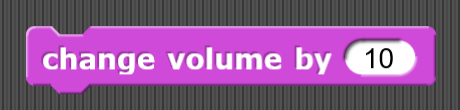

# Sound
Blocks in this category are used to play various sounds. They can also be used to change the volume or duration of a sound or the instrument playing the sound.

## Play sound

| Example | Definition |
|:- |:- |
|  | ](./assets/ |
](./assets/

## Play sound until done

| Example | Definition |
|:- |:- |
|  | ](./assets/ |
](./assets/

## Stop all sounds

| Example | Definition |
|:- |:- |
|  | ](./assets/ |
](./assets/

## Play sound at frequency

| Example | Definition |
|:- |:- |
|  | ](./assets/ |
](./assets/

## Properties of sound

| Example | Definition |
|:- |:- |
|  | ](./assets/ |
](./assets/

## Rest for set amount of beats

| Example | Definition |
|:- |:- |
|  | ](./assets/ |
](./assets/

## Play a note for set amount of beats

| Example | Definition |
|:- |:- |
|  | ](./assets/ |
](./assets/

## Set instrument

| Example | Definition |
|:- |:- |
|  | ](./assets/ |
](./assets/

## Change tempo by a set integer

| Example | Definition |
|:- |:- |
|  | ](./assets/ |
](./assets/

## Set tempo to a specific beats per minute

| Example | Definition |
|:- |:- |
|  | ](./assets/ |
](./assets/

## Tempo

| Example | Definition |
|:- |:- |
|  | ](./assets/ |
](./assets/

## Change volume by a set integer

| Example | Definition |
|:- |:- |
|  | ](./assets/ |
](./assets/

## Set volume to a certain percentage

| Example | Definition |
|:- |:- |
|  | ](./assets/ |
](./assets/

## Volume

| Example | Definition |
|:- |:- |
|  | ](./assets/ |
](./assets/

## Change balance by a set integer

| Example | Definition |
|:- |:- |
|  | ](./assets/ |
](./assets/

## Set balance to a set integer

| Example | Definition |
|:- |:- |
|  | ](./assets/ |
](./assets/

## Balance

| Example | Definition |
|:- |:- |
|  | ](./assets/ |
](./assets/

## Play frequency at a set hertz

| Example | Definition |
|:- |:- |
|  | ](./assets/ |
](./assets/

## Stop frequency

| Example | Definition |
|:- |:- |
|  | ](./assets/ |
](./assets/

