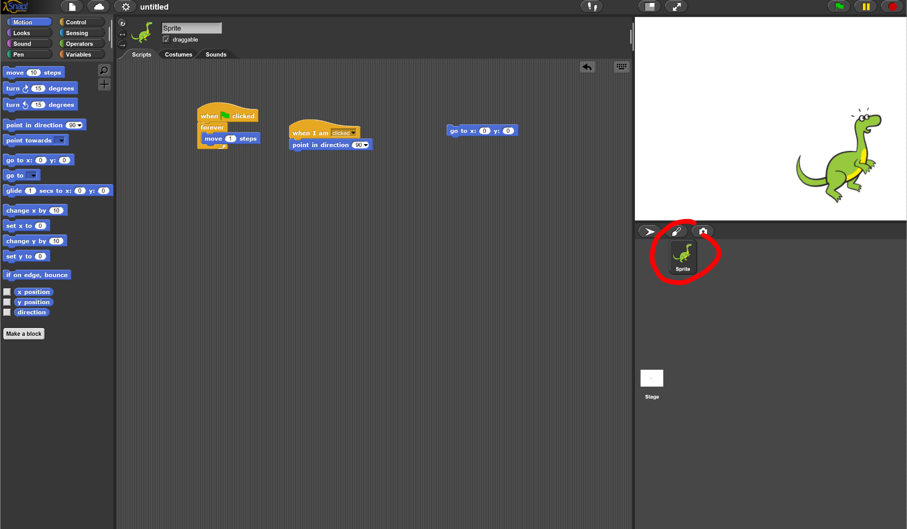
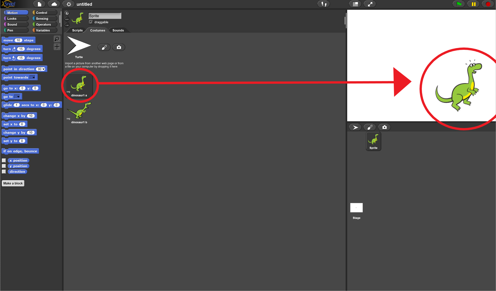
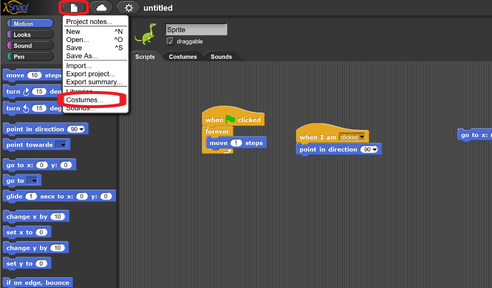
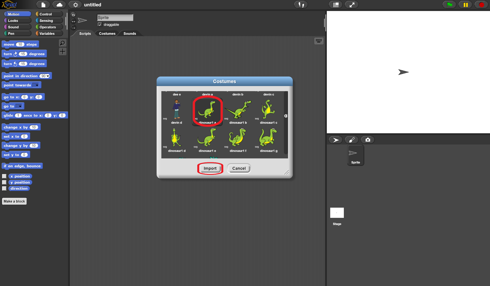
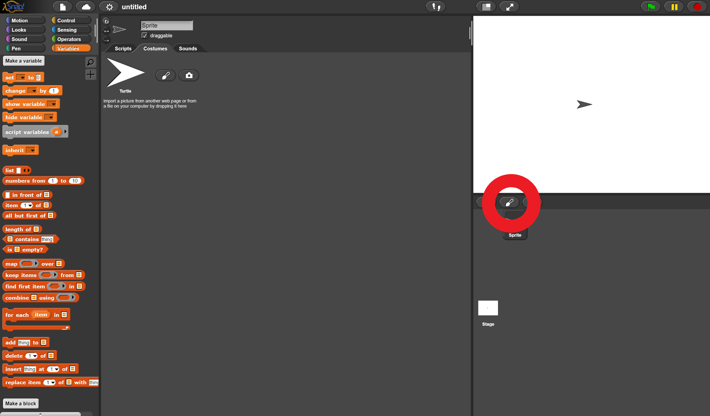
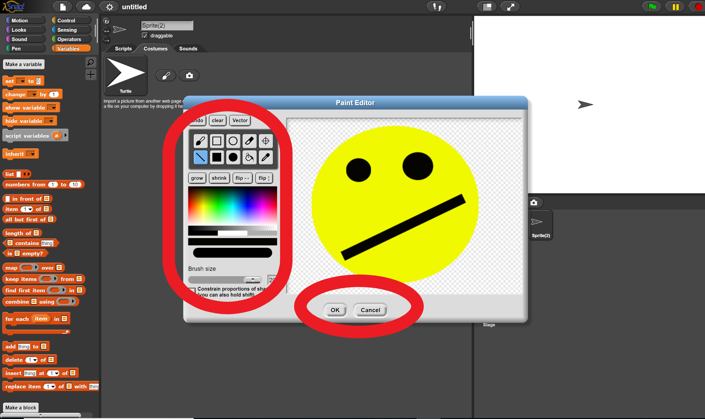
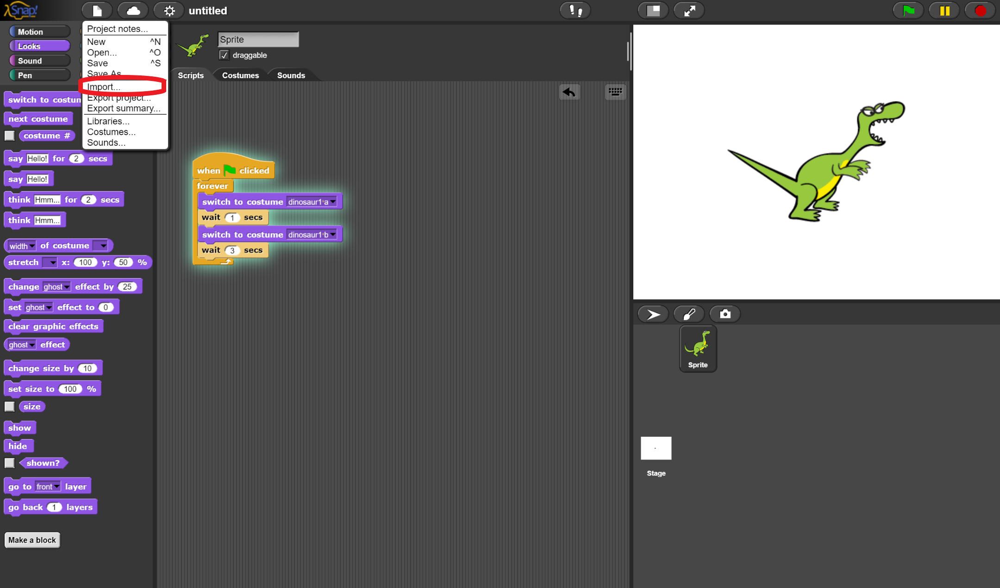
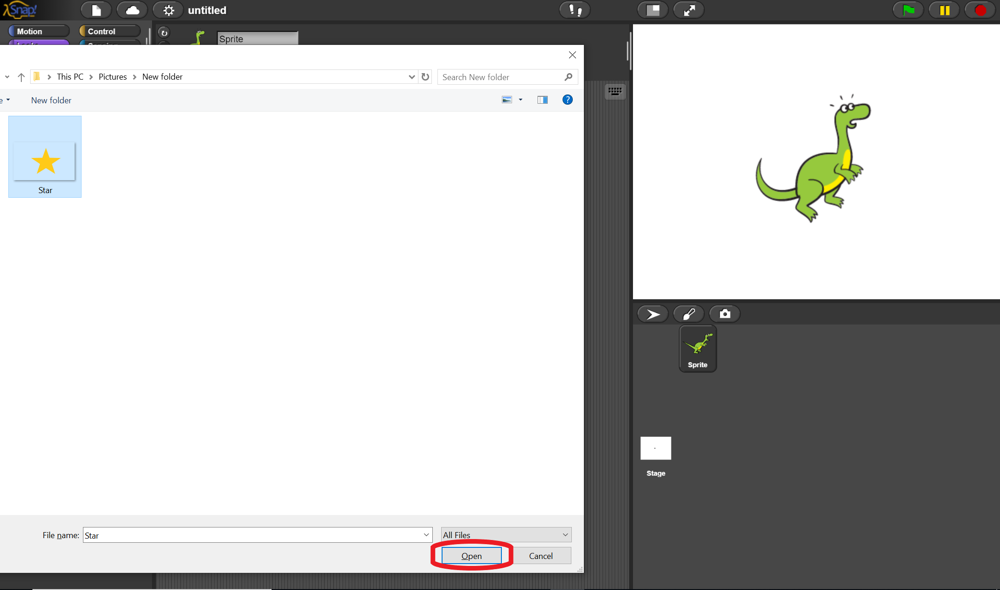
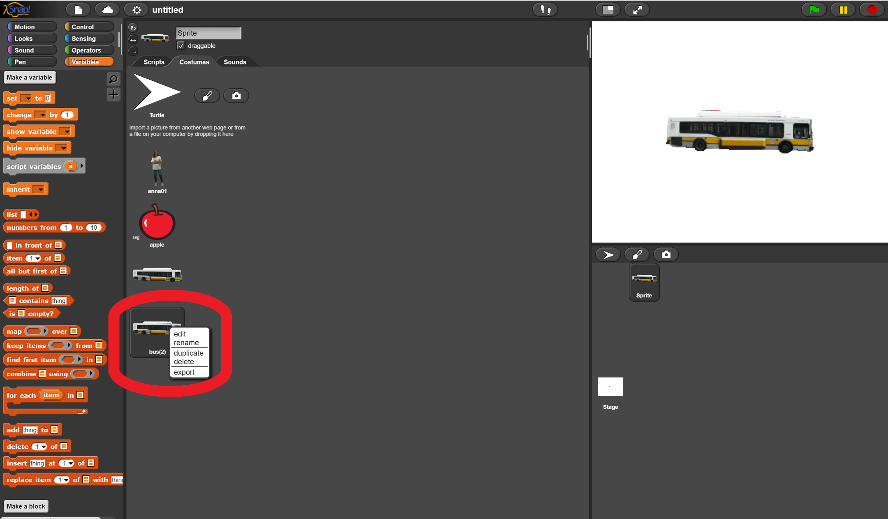
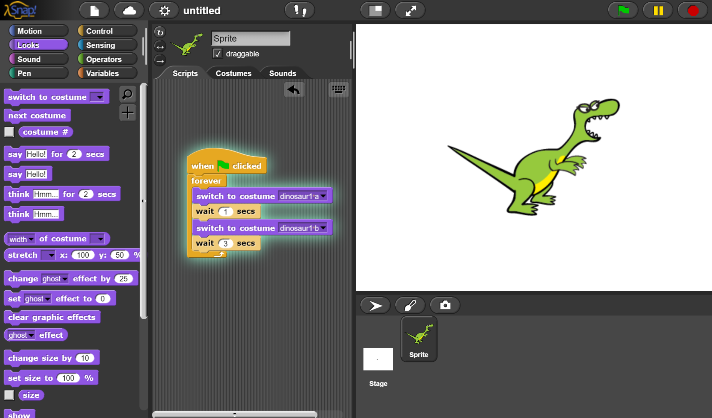

# Costumes

## **Short definition**:
What the sprite looks like (triangle, dog, cat).

## **Long definition**:
The costume is the display of the sprite. For instance, the starter sprite's costume is an image of a triangle. A sprite can have multiple costumes and switch between them.

### How do I view my sprite's costume?
<ol>
  <li>
    Select the sprite you want to see the costume of.
       
    
       
  </li>
  <li>
    Select "Costume" next to "Scripts.
       
    
       
  </li>
  <li>
    The selected costume is what is currently being displayed.
       
    
       
  </li>
</ol>
<h3> How do I add new costumes to my sprite? </h3>
<h4> There are three ways: </h4>
<ol>
  <li> Use a prebuilt image. </li>
  <li> Draw your own image. </li>
  <li> Get an image stored on your computer. </li>
</ol>
<h4> 1) Use a prebuilt image online. </h4>
<ol>
  <li> Select the sprite you want to add the costume to.
       
  </li>
  <li>
    Click on the file icon, then click on "Costumes..." in the drop down menu.
       
     
  </li>
  <li>
    Select the costume you want and select "Import". When you are done importing costumes, select "Cancel".
       
       
  </li>
</ol>

<h4> 2) Draw your own image </h4>
<ol>
  <li>
    Click on the paintbrush icon.
       
    
       
  </li>
  <li>
    Draw your sprite and select "OK".
       
    
       
  </li>
</ol>
<h4> 3) Use an image from your computer </h4>
<ol>
  <li>
    Select the sprite you want to add the costume to.
       
  </li> 
  <li>
    Click on the file icon, then click on "Import" in the drop down menu.
       
    
       
  </li> 
  <li>
    Select your image and select open.
       
    
       
  </li> 
</ol>
<h3> How do I delete a costume? </h3>
Right click on it and select delete in the drop down menu.
   

<h2> Using Multiple Costumes </h2>
<h3> What are the benefits of having multiple costumes? </h3>
Multiple costumes allow for the animation of objects and allow for the visualization of actions. For instance, if you have a dragon and want it to breath fire when another sprite gets too close, you can have a costume for a walking dragon and another for a dragon breathing fire. Similarily, if you have a frog that transforms into a prince, you can have multiple costumes for that transformation.
<h3> How do I switch between costumes? </h3>
There are two ways:
<ol>
  <li>
    You can manually switch between costumes by clicking on them in the "Costumes" tab next to Scripts.
  </li>
  <li>
    You can automatically swtich between costumes by using the block "switch to costume" or "next costume" in the looks category.
  </li>
    
  
  
</ol>
